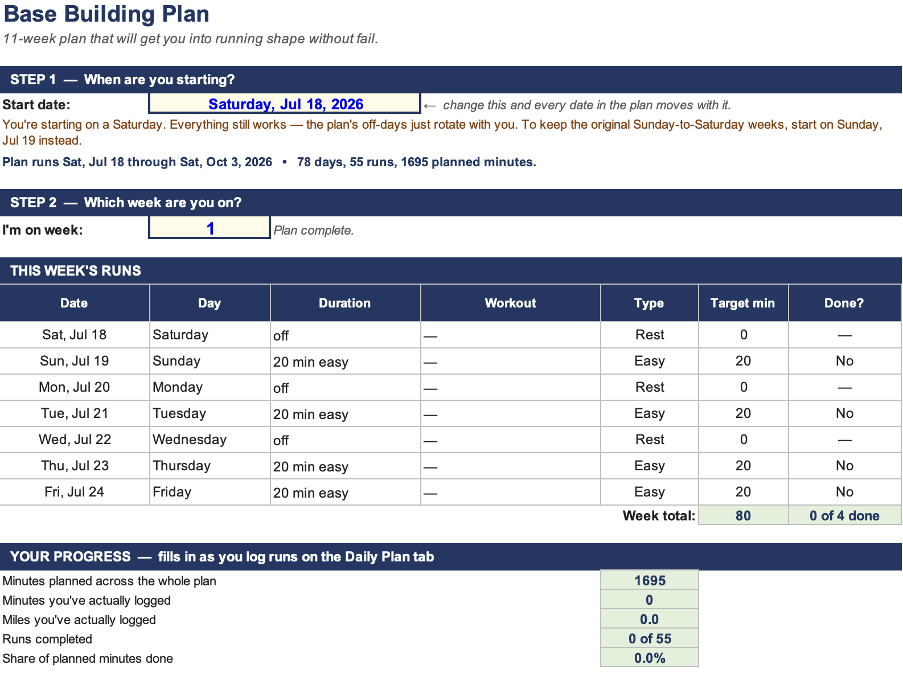
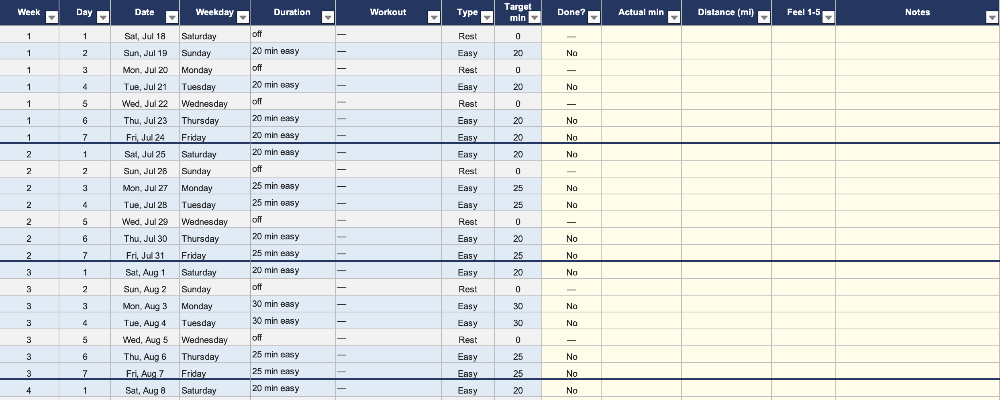
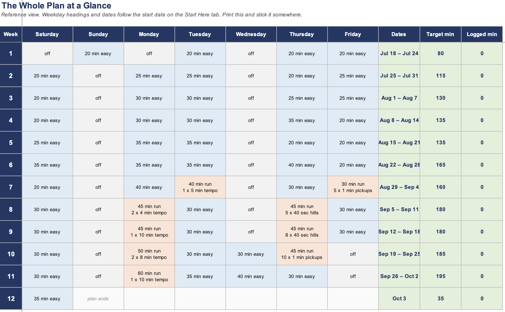

# Running Plan Template

Excel template for an 11-week base-building running plan.

## Contents
- Running_Plan.xlsx

## Sheets
- Start Here: set the start date and current week. Shows that week's runs, progress totals, and a key for the shorthand.
- Daily Plan: the full plan, one row per day. Dates are formulas driven by the start date. Log completed runs here (Done?, actual minutes, distance, feel, notes).

## Plan
- Runs: easy, tempo, pickups, hills. Rest days are scheduled.
- Duration: 20 to 60 minutes per run.
- Time-based, not distance-based.

## Usage
1. Open in Excel.
2. Change the start date on the `Start Here` tab. 

    

3. Log runs in the yellow columns on the `Daily Plan` tab. Do not overwrite the dates in the Date column

    

4. Use the `Week Grid` tab for a calendar view of the whole plan.

    